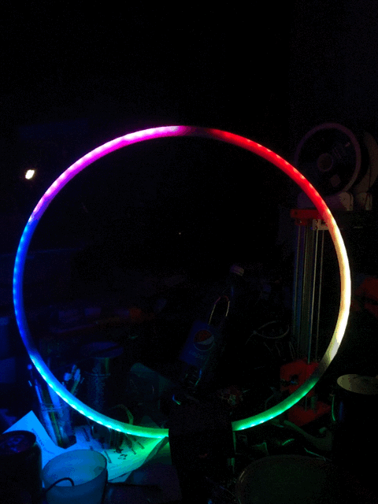

# SmartWhoopGate32

By [Marcel Verdult](https://github.com/marcelverdult)
and [Jan Ryklikas](https://github.com/soulofnoob)

## Summary (Work in Progress)

  In this project we created "Smart" TinyWhoop drone gates for indoor flying.

  "Smart" meaning they are connected to a 5,8GHz video receiver and can change their color based on frequencys in range.

  Currently we use one color for every frequency inside the Race-Band.

  The different Lighting modes can be controlled via [MQTT](#mqtt-reference)

 

## Parts List

- ESP32 (we used the "DOIT Esp32 DevKit v1")
- WS2812B LED Strip (we used the 60LED/M variant and 90 LEDs per Gate)
- RX5808 5,8 GHz receiver (potentionally needs to be modified for SPI)
- 5V 3A Power Supply
- DC Barrel Jack
- Lasercutted / 3D printed housing
- ca 160cm of stiff tubing at least 9.8mm in diameter (we needed to cut off ca 2mm of the led strip to make it fit)

## To make the code work

1. Wait until i made a propper tutorial ^^
2. try to find the wifi and MQTT server settings and change to your network and server
3. find the firmware.h file and change the FIRMWARE_VERSION to 0.0 that way you force the controller to update its eeprom with the data you just set
4. the controller will restart, connect to wifi, and pull the newest binary.
5. if you want your own code to stay on it, incrase the version number to whatever is higher than the current one to keep it from updating
6. happy hacking :)

## MQTT Reference

- LED
  - ON
    - `LED ON`
  - OFF
    - `LED OFF`
  - PARTY
    - `LED PARTY`
  - MODE
    - `LED MODE <11>`
- MAXRSSI
  - AUTORESET
    - ON
      - `MAXRSSI AUTORESET ON`
    - OFF
      - `MAXRSSI AUTORESET OFF`
  - RESET
    - `MAXRSSI RESET`
  - SET
    - `MAXRSSI SET [1] <2500>`
- EEPROM
  - SET
    - NAME
      - `EEPROM SET NAME <Gate10>`
    - NETWORK
      - []
        - `EEPROM SET NETWORK [0] <ssid:pass:mqtt>`
- UPDATE
  - `UPDATE`
- RESTART
  - `RESTART`

## new MQTT Reference

### Command Topics

gates/gate&lt;x>/cmnd/%command%
gates/all/cmnd/%command%
  
| Command        | Parameters                                         |
| ----------     | -------------------------------------------------- |
| power          | `0` / `off` = turn OFF   `1` / `on` = turn ON   `2` / `toggle` = toggle ON/OFF |
| mode           | `11..16` = set LED mode                            |
| brightness     | `0..255` = set LED brightness                      |
| restart        | send empty message to trigger restart              |
| update         | send empty message to trigger update               |
| rssi_reset     | send empty message to trigger rssi reset           |
| rssi_autoreset | `0` / `off` = turn OFF   `1` / `on` = turn ON  |
| maxrssi&lt;x>  | `0..4000`   x = `0..7`                         |
| name           | `<name>`                                           |
| network&lt;x>  | `<ssid>;<pass>;<mqtt>`   x = `0..4`            |

### Status Topics

gates/gate&lt;x>/stat/%command%
gates/all/stat/%command%

### telemetry Topics

gates/gate&lt;x>/tele
